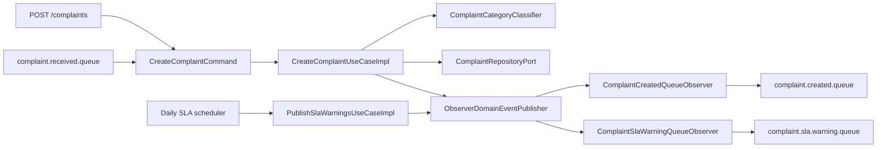

# 📝 Complaint Management Service

<p align="center">
  
  
  
  
  
  
</p>

<p align="center">
  Production-style PoC built for a senior technical case, combining hexagonal architecture,
  lightweight CQRS, persisted complaint classification, embedded messaging, and strict build quality gates.
</p>

<p align="center">
  <a href="#overview">Overview</a> |
  <a href="#architecture">Architecture</a> |
  <a href="#running-locally">Running Locally</a> |
  <a href="#rest-api">REST API</a> |
  <a href="#messaging">Messaging</a> |
  <a href="#automatic-complaint-classification">Classification</a> |
  <a href="#domain-event-flow">Domain Events</a>
</p>

---

## Overview

`complaint-management-service` is a production-style PoC built with Java 17 and Spring Boot 4.
It receives complaints through REST and JMS, classifies them with persisted category keywords, stores them in H2 through JPA, and publishes asynchronous notifications through an embedded ActiveMQ broker.

This project is intentionally structured for a senior-level technical case.

### At a Glance

| Dimension | Details |
|---|---|
| Primary purpose | Complaint intake, classification, persistence, and asynchronous event publication |
| Entry points | REST `POST /complaints`, REST `GET /complaints`, JMS `complaint.received.queue` |
| Core architectural style | Hexagonal architecture with strict layer boundaries |
| Business style | Domain-centric model with always-valid objects |
| Coordination style | Lightweight CQRS with commands and queries |
| Messaging style | Observer-based domain event publication with embedded ActiveMQ |
| Local execution | H2 in-memory database, Flyway migrations, embedded broker, scheduler |
| Quality gate | Full Maven verification with JaCoCo at `100%` |

### Project Highlights

- Hexagonal architecture with strict layer boundaries
- Domain-centric design with always-valid domain objects
- Separate input DTOs and mappers per channel
- Lightweight CQRS with commands and queries
- Observer-based domain event flow
- Resilience around infrastructure-facing adapters
- Embedded infrastructure for local execution
- Full Maven build verification with JaCoCo at 100%

---

## Architecture

### Macro Layers

| Layer | Responsibility |
|---|---|
| `domain` | Pure business model, business rules, value objects, domain services, and domain events |
| `application` | Use cases, commands, queries, ports, and observer-style domain event publishing |
| `adapters.in` | REST controllers, HTTP error models, request/response DTOs, JMS listener, and input mappers |
| `adapters.out` | Persistence adapters, messaging adapters, configuration, and resilience support |
| `root package` | Application bean wiring |

### Layer Notes

- `domain`
  - Value objects such as `Cpf`, `EmailAddress`, `ComplaintText`, and `DocumentUrl`
  - Domain services such as complaint classification and SLA policy
  - Domain events such as complaint creation and SLA warning triggering
- `adapters.out.config`
  - Embedded ActiveMQ setup
  - Configuration properties
  - H2 console registration
- `adapters.out.resilience`
  - Resilience support for outbound integrations

### High-level Flow



### Project Structure

```text
src/main/java/com/complaintmanagementservice
|-- adapters
|   |-- in
|   |   |-- messaging
|   |   |-- rest
|   |   `-- scheduler
|   `-- out
|       |-- config
|       |-- messaging
|       |-- persistence
|       `-- resilience
|-- ApplicationConfiguration.java
|-- application
`-- domain
```

---

## Technical Decisions

- The domain does not depend on Spring, JPA, JMS, or Bean Validation.
- REST and queue payloads are intentionally different and normalized by dedicated mappers into the same `CreateComplaintCommand`.
- Commands and queries use manual builders and keep transport-neutral data. They remain lightweight carriers, and domain objects are created inside the use cases.
- Complaint classification is data-driven. Categories and keywords are loaded from the database, so new categories can be introduced without changing classifier code.
- Complaint status is modeled as a domain enum and also backed by a reference table with fixed ids:
  - `1 = PENDING`
  - `2 = PROCESSING`
  - `3 = RESOLVED`
- The initial complaint status is always `PENDING` and is never chosen by the client.
- The HTTP layer returns explicit error response models instead of exposing raw `ProblemDetail`.
- Resilience is applied at the outgoing adapter boundary, mainly around persistence and queue publishing, so business rules stay clean.
- ActiveMQ runs embedded inside the application with dead-letter handling configured through destination policy.
- Flyway is the only mechanism used to create and seed the database schema.

---

## Technology Stack

| Category | Technology |
|---|---|
| Language | Java 17 |
| Framework | Spring Boot 4.0.4 |
| Build | Maven |
| Web | Spring Web |
| Persistence | Spring Data JPA |
| Validation | Bean Validation |
| Database | H2 embedded database |
| Migration | Flyway |
| Messaging | JMS with embedded ActiveMQ |
| Resilience | Resilience4j |
| Testing | JUnit 5 + Mockito |
| Coverage | JaCoCo |

---

## Running Locally

### Prerequisites

- Java 17
- Maven 3.9+ if you prefer not to use the Maven Wrapper

This repository includes the Maven Wrapper, so the recommended commands are:

- Windows: `mvnw.cmd`
- Linux/macOS: `./mvnw`

### Quick Start

1. Start the application:

```bash
./mvnw spring-boot:run
```

2. If port `8080` is already in use:

```bash
./mvnw spring-boot:run "-Dspring-boot.run.arguments=--server.port=0"
```

### What Starts Automatically

When the application starts, it also brings up:

- H2 in-memory database
- Flyway migrations and reference data
- Embedded ActiveMQ broker
- JMS queues used by the application
- Daily scheduler

### Local Endpoints

| Endpoint | URL |
|---|---|
| API base URL | `http://localhost:8080` |
| H2 console | `http://localhost:8080/h2-console/` |

### H2 Connection Values

| Property | Value |
|---|---|
| JDBC URL | `jdbc:h2:mem:complaintsdb;MODE=PostgreSQL;DB_CLOSE_DELAY=-1;DB_CLOSE_ON_EXIT=FALSE` |
| User | `sa` |
| Password | empty |

---

## Build, Tests, and Coverage

| Goal | Command |
|---|---|
| Complete build verification | `./mvnw clean verify` |
| Test suite only | `./mvnw test` |
| Open JaCoCo report | `target/site/jacoco/index.html` |

The Maven build is configured to fail if coverage is below 100% for:

- instructions
- branches
- lines
- methods

---

## Flyway and Reference Data

Flyway migration:

- `src/main/resources/db/migration/V1__create_schema.sql`

### Created and Seeded Tables

| Table | Purpose |
|---|---|
| `customers` | Customer data |
| `complaint_statuses` | Reference status catalog |
| `categories` | Complaint categories |
| `category_keywords` | Keywords per category |
| `complaints` | Complaint aggregate root persistence |
| `complaint_categories` | Complaint-category association |
| `complaint_documents` | Optional document URLs |

Reference data includes:

- complaint statuses
- initial complaint categories
- initial category keywords

---

## REST API

### POST `/complaints`

Creates a complaint through the REST channel.

#### Request Example

```json
{
  "customer": {
    "cpf": "52998224725",
    "name": "Maria Silva",
    "birthDate": "1990-05-10",
    "email": "maria.silva@example.com"
  },
  "complaintCreatedDate": "2026-03-20",
  "complaintText": "Não consigo acessar o app e a senha sempre falha",
  "documentUrls": [
    "https://example.com/documents/evidence-1.pdf",
    "https://example.com/documents/evidence-2.pdf"
  ]
}
```

#### cURL Example

```bash
curl -i -X POST "http://localhost:8080/complaints" \
  -H "Content-Type: application/json" \
  -d '{
    "customer": {
      "cpf": "52998224725",
      "name": "Maria Silva",
      "birthDate": "1990-05-10",
      "email": "maria.silva@example.com"
    },
    "complaintCreatedDate": "2026-03-20",
    "complaintText": "Não consigo acessar o app e a senha sempre falha",
    "documentUrls": [
      "https://example.com/documents/evidence-1.pdf"
    ]
  }'
```

#### Success Response Example

```json
{
  "complaintId": "11111111-1111-1111-1111-111111111111",
  "statusId": 1,
  "statusName": "PENDING"
}
```

#### Error Response Examples

Validation and parsing errors return a field-oriented structure:

```json
{
  "title": "Dados inválidos",
  "status": 400,
  "errors": [
    {
      "field": "customer.email",
      "message": "Formato inválido"
    }
  ]
}
```

Business and generic failures return a simple message structure:

```json
{
  "title": "Regra de negócio violada",
  "status": 422,
  "message": "A data da reclamação não pode ser futura."
}
```

Expected behavior:

- returns `201 Created`
- sets the `Location` header to `/complaints/{complaintId}`
- persists the complaint
- classifies the complaint automatically
- publishes a complaint-created notification

### GET `/complaints`

Searches complaints ordered from newest complaint date to oldest.

#### Supported Optional Filters

- `customerCpf`
- `categories`
- `status`
- `startDate`
- `endDate`

#### Date Rules

- only `startDate`: returns complaints from that date onward
- only `endDate`: returns complaints from the beginning up to that date
- both dates: returns the range
- no dates: returns everything

#### cURL Example

```bash
curl "http://localhost:8080/complaints?customerCpf=52998224725&categories=acesso&categories=aplicativo&status=1&startDate=2026-03-01&endDate=2026-03-31"
```

#### Response Example

```json
[
  {
    "complaintId": "11111111-1111-1111-1111-111111111111",
    "complaintCreatedDate": "2026-03-20",
    "complaintText": "Não consigo acessar o app e a senha sempre falha",
    "status": {
      "id": 1,
      "name": "PENDING"
    },
    "customer": {
      "cpf": "52998224725",
      "name": "Maria Silva",
      "birthDate": "1990-05-10",
      "email": "maria.silva@example.com"
    },
    "categories": [
      {
        "id": 4,
        "name": "acesso"
      },
      {
        "id": 5,
        "name": "aplicativo"
      }
    ],
    "documentUrls": [
      "https://example.com/documents/evidence-1.pdf"
    ],
    "registeredAt": "2026-03-23T00:00:00Z"
  }
]
```

---

## Messaging

### Configured Queues

| Queue | Purpose |
|---|---|
| `complaint.received.queue` | Inbound complaint creation |
| `complaint.created.queue` | Outbound complaint-created event |
| `complaint.sla.warning.queue` | Outbound SLA warning event |

Dead-letter queues are configured with the `DLQ.` prefix by ActiveMQ policy. For example:

- `DLQ.complaint.received.queue`

### Inbound Message Format

The queue listener accepts a different payload than the REST API.

```json
{
  "customerDocument": "52998224725",
  "customerFullName": "Maria Silva",
  "customerBirthDate": "1990-05-10",
  "customerEmailAddress": "maria.silva@example.com",
  "occurrenceDate": "2026-03-20",
  "description": "Não consigo acessar o app e a senha sempre falha"
}
```

### Example of Sending a Message to the Inbound Queue

This PoC uses an embedded broker with VM transport, so queue publishing is intended to happen in-process.
The simplest way to send a message manually is through `JmsTemplate` inside the running application context:

```java
CreateComplaintQueueMessage payload = new CreateComplaintQueueMessage(
        "52998224725",
        "Maria Silva",
        LocalDate.of(1990, 5, 10),
        "maria.silva@example.com",
        LocalDate.of(2026, 3, 20),
        "Não consigo acessar o app e a senha sempre falha"
);

jmsTemplate.convertAndSend("complaint.received.queue", payload);
```

### Published Queue Messages

After a complaint is created successfully:

```json
{
  "complaintId": "11111111-1111-1111-1111-111111111111",
  "createdAt": "2026-03-23T00:00:00Z"
}
```

When the SLA warning job finds a complaint near the deadline:

```json
{
  "complaintId": "11111111-1111-1111-1111-111111111111",
  "slaDeadlineDate": "2026-03-30"
}
```

---

## Automatic Complaint Classification

Classification is based on complaint text and persisted category keywords.

### Initial Categories

| Category | Initial Keywords |
|---|---|
| `imobiliario` | `credito imobiliario`, `casa`, `apartamento` |
| `seguros` | `resgate`, `capitalizacao`, `socorro` |
| `cobranca` | `fatura`, `cobranca`, `valor`, `indevido` |
| `acesso` | `acessar`, `login`, `senha` |
| `aplicativo` | `app`, `aplicativo`, `travando`, `erro` |
| `fraude` | `fatura`, `nao reconhece divida`, `fraude` |

### How It Works

- the classifier normalizes the complaint text
- it compares the normalized text with the persisted keyword catalog
- it returns all matching categories
- it does not require code changes to introduce new categories or new keywords

Because categories are loaded from the database, evolving the catalog is a data change, not a source-code change.

---

## Domain Event Flow

Complaint creation and SLA warning publication use a classic observer flow.

### Complaint Creation Flow

1. A complaint is created in the domain and emits `ComplaintCreatedDomainEvent`.
2. The application saves the complaint.
3. The application publishes the domain event through `ObserverDomainEventPublisher`.
4. Registered observers are notified through the shared `DomainEventObserver` contract.
5. `ComplaintCreatedQueueObserver` reacts to `ComplaintCreatedDomainEvent`.
6. The messaging adapter publishes the final message to `complaint.created.queue`.

### SLA Warning Flow

1. The scheduler triggers `PublishSlaWarningsUseCaseImpl`.
2. The use case identifies complaints that entered the SLA warning window.
3. The use case publishes `ComplaintSlaWarningTriggeredDomainEvent`.
4. `ComplaintSlaWarningQueueObserver` reacts to that domain event.
5. The messaging adapter publishes the final message to `complaint.sla.warning.queue`.

This keeps the domain independent from ActiveMQ while still enabling asynchronous reactions after successful creation.

---

## SLA Warning Job

The scheduled job runs every day at `07:00` using:

- `application.scheduler.sla-warning-cron=0 0 7 * * *`

### Rule

- consider complaints whose status is not `RESOLVED`
- calculate the SLA deadline as `complaint created date + 10 days`
- publish a warning when the complaint is exactly 3 days away from that deadline

In practice, the scheduler looks for complaints created 7 days before the reference day and publishes one message per matching complaint.

Duplicate warning publication is allowed in this PoC.

---

## Validation Strategy

Validation is intentionally split into three levels.

| Level | Scope | Examples |
|---|---|---|
| Edge validation | REST DTOs and queue DTOs | Bean Validation, field format validation |
| Application validation | Use cases, commands, and queries | input normalization when useful, semantic range checks |
| Domain validation | Entities and value objects | always-valid business objects and invariants |

This keeps invalid state out of the system as early as possible while still protecting the core domain.
Commands and queries remain lightweight and do not instantiate domain objects by themselves.

---

## Resilience Strategy

Resilience is applied to outbound infrastructure-facing operations:

- persistence adapter
- queue publisher adapter

### Goals

- fail fast
- reduce pressure on degraded infrastructure
- keep retry logic out of controllers and domain objects

Outbound adapter failures are not wrapped in artificial exceptions. Anything that is not mapped explicitly in the HTTP layer falls back to a friendly `500` response.

Profiles are configured in `src/main/resources/application.yml` for:

- `application.resilience.persistence`
- `application.resilience.messaging`

---

## Main Files

| Area | File |
|---|---|
| Application entry point | `src/main/java/com/complaintmanagementservice/ComplaintManagementServiceApplication.java` |
| Application configuration | `src/main/java/com/complaintmanagementservice/ApplicationConfiguration.java` |
| REST controller | `src/main/java/com/complaintmanagementservice/adapters/in/rest/ComplaintController.java` |
| REST exception handler | `src/main/java/com/complaintmanagementservice/adapters/in/rest/ApiExceptionHandler.java` |
| Queue listener | `src/main/java/com/complaintmanagementservice/adapters/in/messaging/ComplaintReceivedListener.java` |
| Scheduler | `src/main/java/com/complaintmanagementservice/adapters/in/scheduler/SlaWarningScheduler.java` |
| Complaint creation use case | `src/main/java/com/complaintmanagementservice/application/usecase/CreateComplaintUseCaseImpl.java` |
| Complaint search use case | `src/main/java/com/complaintmanagementservice/application/usecase/SearchComplaintsUseCaseImpl.java` |
| SLA warning use case | `src/main/java/com/complaintmanagementservice/application/usecase/PublishSlaWarningsUseCaseImpl.java` |
| Domain classifier | `src/main/java/com/complaintmanagementservice/domain/service/ComplaintCategoryClassifier.java` |
| SLA policy | `src/main/java/com/complaintmanagementservice/domain/service/ComplaintSlaPolicy.java` |
| SLA warning domain event | `src/main/java/com/complaintmanagementservice/domain/event/ComplaintSlaWarningTriggeredDomainEvent.java` |
| Messaging configuration | `src/main/java/com/complaintmanagementservice/adapters/out/config/MessagingConfiguration.java` |
| Flyway migration | `src/main/resources/db/migration/V1__create_schema.sql` |

---

## Notes

- The project uses `application.yml` only.
- There is no update or delete flow by design.
- Pagination is intentionally out of scope for this PoC.
- The embedded broker is configured for local execution and technical presentation.
